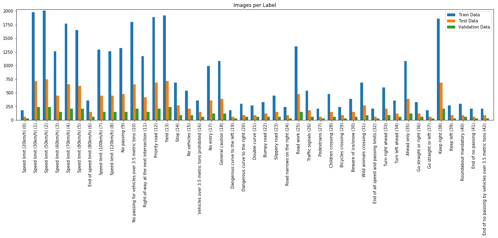
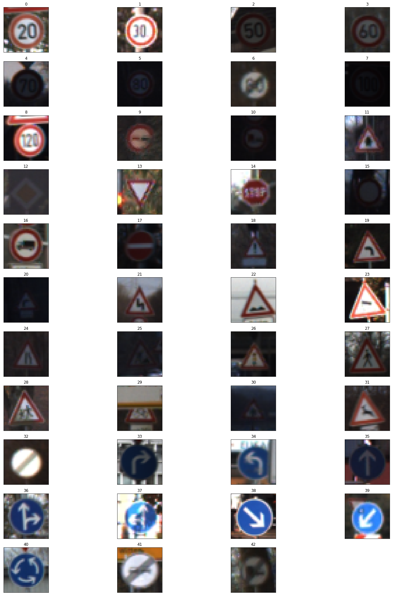
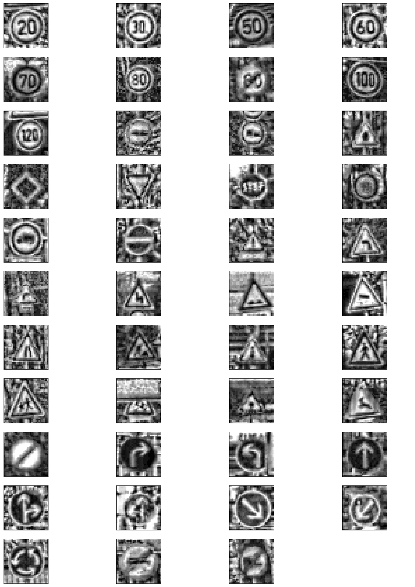
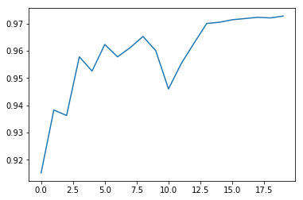
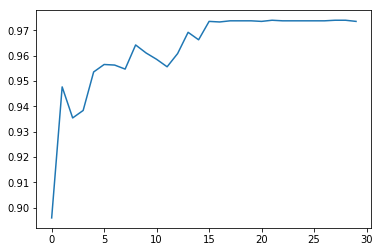
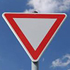
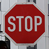
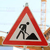
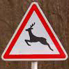
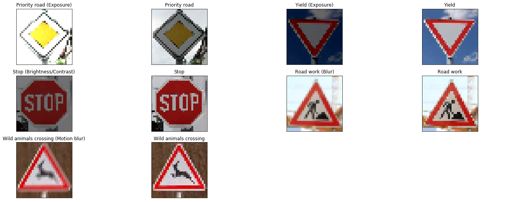

# **Traffic Sign Recognition**

## Writeup

---

**Build a Traffic Sign Recognition Project**

The goals / steps of this project are the following:
* Load the data set (see below for links to the project data set)
* Explore, summarize and visualize the data set
* Design, train and test a model architecture
* Use the model to make predictions on new images
* Analyze the softmax probabilities of the new images
* Summarize the results with a written report

## Rubric Points
### Here I will consider the [rubric points](https://review.udacity.com/#!/rubrics/481/view) individually and describe how I addressed each point in my implementation.  

---
### Writeup / README

#### 1. Provide a Writeup / README that includes all the rubric points and how you addressed each one. You can submit your writeup as markdown or pdf. You can use this template as a guide for writing the report. The submission includes the project code.

### Data Set Summary & Exploration

#### 1. Provide a basic summary of the data set. In the code, the analysis should be done using python, numpy and/or pandas methods rather than hardcoding results manually.

I used the pandas library to calculate summary statistics of the traffic
signs data set:

* The size of training set is 34799
* The size of the validation set is 4410
* The size of test set is 12630
* The shape of a traffic sign image is (32, 32, 3)
* The number of unique classes/labels in the data set is 43

#### 2. Include an exploratory visualization of the dataset.

This bar chart visualizes the distribution of the data sets.

These are examples of the different classes.

### Design and Test a Model Architecture

#### 1. Describe how you preprocessed the image data. What techniques were chosen and why did you choose these techniques? Consider including images showing the output of each preprocessing technique. Pre-processing refers to techniques such as converting to grayscale, normalization, etc. (OPTIONAL: As described in the "Stand Out Suggestions" part of the rubric, if you generated additional data for training, describe why you decided to generate additional data, how you generated the data, and provide example images of the additional data. Then describe the characteristics of the augmented training set like number of images in the set, number of images for each class, etc.)

In the preprocess the images are converted to a single channel `Y` from `YcbCr`. This is as per Pierre Sermanet's and Yann Lecun's paper on ["Traffic Sign Recognition with Multi-Scale Convolutional Networks"](http://yann.lecun.com/exdb/publis/pdf/sermanet-ijcnn-11.pdf) where that the insignificant improvement when using color channels does not justify the increased complexity of the calculation.
Additionally I enhance the contrast by using  [adaptive histogram equalization](https://en.wikipedia.org/wiki/Adaptive_histogram_equalization) for improved feature extraction.

These are the preprocessed images.

#### 2. Describe what your final model architecture looks like including model type, layers, layer sizes, connectivity, etc.) Consider including a diagram and/or table describing the final model.

My final model consisted of the following layers:

| Layer         		|     Description	                              |
|:-----------------:|:---------------------------------------------:|
| Input         		| 32x32x1 single channel image                  |
| Convolution 3x3   | 1x1 stride, valid padding, outputs 28x28x12   |
| RELU					    |						                                    |
| Max Pooling	      | 2x2 stride, outputs 14x14x12                  |
| Convolution 3x3	  | 2x2 stride, valid padding, outputs 14x14x32   |   
| RELU					    |	                                              |
| Max Pooling	      | 2x2 stride, outputs 5x5x32                    |
| Fully Connected	  | Input: 800 Output: 512                        |
| RELU					    |	                                              |
| Fully Connected	  | Input: 512 Output: 256                        |        
| RELU					    |                                    						|
| Fully Connected	  | Input: 256 Output: 43 (`n_classes`)           |
| Softmax				    |         	                                    |

#### 3. Describe how you trained your model. The discussion can include the type of optimizer, the batch size, number of epochs and any hyperparameters such as learning rate.

To train the model, I used an 20 epochs and AdamOptimizer with a starting learning rate of 0.0001 which proofed best after a some trails.

#### 4. Describe the approach taken for finding a solution and getting the validation set accuracy to be at least 0.93. Include in the discussion the results on the training, validation and test sets and where in the code these were calculated. Your approach may have been an iterative process, in which case, outline the steps you took to get to the final solution and why you chose those steps. Perhaps your solution involved an already well known implementation or architecture. In this case, discuss why you think the architecture is suitable for the current problem.

I started with grayscale and normalization preprocessing and took the LeNet model as base. However I did not reach the desired accuracy and got stuck below 90%. I then adjusted the
fully connected features and the hidden layer to cater the higher detailed images and the higher number of classes we got in this project. This drive the accuracy above 90%.
I shuffle the the dataset before each epoch and use batches of 128.
I experimented with the learning rate a bit and got the best results with 0.001.
The final improvement was achieved by applying [adaptive histogram equalization](https://en.wikipedia.org/wiki/Adaptive_histogram_equalization) to the images to improve their contrast.

I tried various numbers of epochs but I always seemed to reach a plateau at around 20 epochs.

My final model results were:
* training set accuracy of 1.000
* validation set accuracy of 0.973
* test set accuracy of 0.954

### Test a Model on New Images

#### 1. Choose five German traffic signs found on the web and provide them in the report. For each image, discuss what quality or qualities might be difficult to classify.

Here are five German traffic signs that I found on the web.

  
 

I made sure to use images of different classes in front of solid or noisy backgrounds.

Because my model was able to predict all those images I tried to decrease their quality by making them artificially blurry, overexposing them, reducing brightness and contrast etc. However my model did not fail to predict them.

#### 2. Discuss the model's predictions on these new traffic signs and compare the results to predicting on the test set. At a minimum, discuss what the predictions were, the accuracy on these new predictions, and compare the accuracy to the accuracy on the test set (OPTIONAL: Discuss the results in more detail as described in the "Stand Out Suggestions" part of the rubric).

Here are the results of the prediction.

| Image			            |     Prediction	        					|
|:---------------------:|:---------------------------------:|
| Priority road     		| Priority road   									|
| Priority road   			| Priority road								      |
| Yield					        | Yield											        |
| Yield      		        | Yield					 				            |
| Stop		              | Stop      							          |
| Stop		              | Stop      							          |
| Road work		          | Road work      							      |
| Road work		          | Road work      							      |
| Wild animals crossing | Wild animals crossing      				|
| Wild animals crossing | Wild animals crossing      			  |

The model was able to correctly guess 10 of the 10 traffic signs, which gives an accuracy of 1.0. This compares favorably to the accuracy on the test set of 0.954.

#### 3. Describe how certain the model is when predicting on each of the five new images by looking at the softmax probabilities for each prediction. Provide the top 5 softmax probabilities for each image along with the sign type of each probability. (OPTIONAL: as described in the "Stand Out Suggestions" part of the rubric, visualizations can also be provided such as bar charts)

The code for making predictions on my final model is located in the 15th cell of the Ipython notebook.

| Sign | 1st | Confidence  | 2nd |                | 3rd |                | 4th |                | 5th |                |
|:----:|:---:|:-----------:|:---:|:--------------:|:---:|:--------------:|:---:|:--------------:|:---:|:--------------:|
| 12   | 12  | 0.999990225 | 32  | 9.79414381e-06 | 41  | 1.16197008e-09 | 38  | 6.84546364e-10 | 17  | 7.55753307e-11 |
| 12   | 12  | 1.0         | 32  | 6.83923140e-09 | 15  | 2.89615970e-10 | 40  | 1.19743548e-10 | 16  | 3.42062142e-11 |
| 13   | 1   | 1.0         | 15  | 9.84875983e-12 | 12  | 5.77108803e-12 | 35  | 3.63903005e-12 | 5   | 6.30251710e-13 |
| 13   | 13  | 1.0         | 35  | 6.71025472e-15 | 34  | 5.88475505e-16 | 15  | 4.45098503e-16 | 5   | 2.96249667e-16 |
| 14   | 14  | 0.9999547   | 4   | 3.74063602e-05 | 5   | 4.87513898e-06 | 1   | 2.90661251e-06 | 18  | 1.56350893e-07 |
| 14   | 14  | 0.999992251 | 1   | 4.70200303e-06 | 4   | 2.45426827e-06 | 18  | 3.05609234e-07 | 5   | 1.95578139e-07 |
| 25   | 25  | 1.0         | 20  | 7.36543548e-10 | 30  | 2.41232062e-10 | 22  | 6.81098136e-13 | 5   | 3.96421936e-13 |
| 25   | 25  | 1.0         | 20  | 5.44480905e-10 | 24  | 2.49500809e-10 | 30  | 9.45482234e-11 | 22  | 1.22043747e-11 |
| 31   | 31  | 0.979112864 | 10  | 2.08784174e-02 | 23  | 4.54436258e-06 | 21  | 2.55263785e-06 | 11  | 8.76291779e-07 |
| 31   | 31  | 0.804766476 | 10  | 1.31290227e-01 | 23  | 3.55790742e-02 | 19  | 2.13587359e-02 | 21  | 6.98355539e-03 |

It's obvious how the confidence for the first prediction is extremely high, even hitting a solid 1.0.
With the altered images we can observe how they prediction is slightly less confident. Except for the Wild animals crossing where the blurry image has a higher confidence than the original.
The confidence for the second probability is significantly lower for all images. The exception here again is the Wild animals crossing sign. I assume this is due to its triangular shape which is featured in almost all warning signs and its relatively indistinct black symbol.

### (Optional) Visualizing the Neural Network (See Step 4 of the Ipython notebook for more details)
#### 1. Discuss the visual output of your trained network's feature maps. What characteristics did the neural network use to make classifications?
No.
